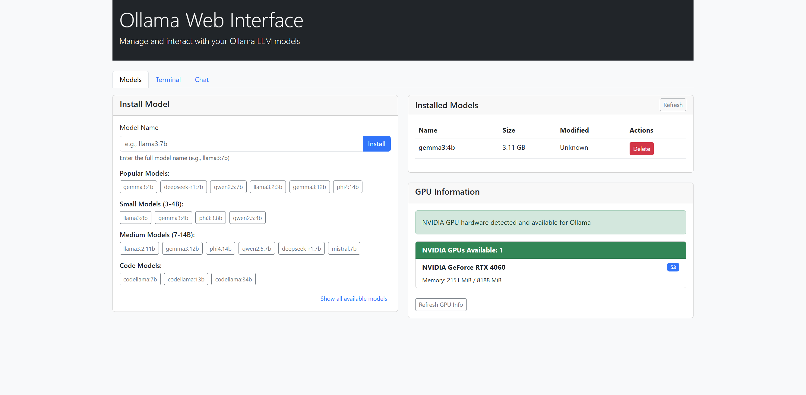

# AIONE - AI One Platform

[](https://opensource.org/licenses/MIT)
[](https://www.docker.com/)
[](https://github.com/NVIDIA/nvidia-container-toolkit)

AIONE (AI One) is an integrated AI development docker image that combines multiple services to create a complete environment for developing, managing, and interacting with AI models. Built on the foundations of Ollama, Weaviate, and PostgreSQL, AIONE provides an easy-to-use interface for AI development with GPU acceleration.

## Interface Screenshots

|              Models Tab              |               Terminal Tab               |             Chat Tab             |
| :----------------------------------: | :--------------------------------------: | :------------------------------: |
|  |  |  |

## Features

- **Comprehensive AI Docker Image**: Built on the official Ollama image with enhanced features
- **Integrated Services**:
  - **Ollama**: For AI model management and inference with custom port 11435
  - **PostgreSQL**: For structured data storage and application state
  - **Weaviate**: For vector database and semantic search capabilities
- **GPU Acceleration**: Automatic detection and utilization of NVIDIA GPUs
- **Real-time GPU Monitoring**: Visual display of GPU usage, temperature, and memory
- **Easy Installation**: One-click setup scripts for Windows, Mac, and Linux
- **Web Interface**: Modern, responsive UI for model management and chat
- **Flexible Deployment**: Run on both GPU and CPU-only environments

## Quick Start

### Prerequisites
- Docker installed and running on your system
- At least 4GB of RAM recommended (8GB+ preferred for larger models)
- At least 10GB of free disk space
- For GPU support: NVIDIA GPU with compatible drivers and NVIDIA Container Toolkit installed

### One-Click Installation & Run

#### On Windows (PowerShell)

You can set up and run AIONE with a single command in PowerShell:

```powershell
irm "https://raw.githubusercontent.com/fionatony/aione/main/baseimage/install.ps1" | iex
```

This script will:
1. Check if Docker is running
2. Clone the repository
3. Build the Docker image
4. Start the container with GPU support if available
5. Open your default browser to access the web interface

#### On Linux/Mac

Set up and run AIONE with a single command:

```bash
curl -sSL "https://raw.githubusercontent.com/fionatony/aione/main/baseimage/install.sh" | bash
```

This script will:
1. Check if Docker is running
2. Clone the repository
3. Build the Docker image with appropriate settings
4. Start the container with GPU support if available
5. Display access information for all services

### Manual Installation

#### On Linux/Mac
1. Clone the repository:
   ```bash
   git clone https://github.com/fionatony/aione.git
   cd aione/baseimage
   ```

2. Make the script executable and run:
   ```bash
   chmod +x build.sh
   ./build.sh
   ```

#### On Windows
1. Clone the repository:
   ```cmd
   git clone https://github.com/fionatony/aione.git
   cd aione\baseimage
   ```

2. Run one of the build scripts:
   
   **Option 1: Using Command Prompt**
   ```cmd
   build.bat
   ```
   
   **Option 2: Using PowerShell (Recommended)**
   ```powershell
   .\build.ps1
   ```
   
   The PowerShell script provides better error handling and feedback.

### Manual Build and Run
If you prefer to build and run manually:

1. Build the Docker image:
   ```bash
   docker build -t aione:latest .
   ```

2. Run the container:
   ```bash
   # Without GPU support
   docker run -d --name aione -p 11435:11435 -p 5433:5433 -p 8081:8081 -p 7071:7071 aione:latest
   
   # With GPU support
   docker run -d --name aione --gpus all -p 11435:11435 -p 5433:5433 -p 8081:8081 -p 7071:7071 aione:latest
   ```

## Verifying Installation

After installation, verify that AIONE is running properly:

1. Check the container status:
   ```bash
   docker ps
   ```

2. View container logs:
   ```bash
   docker logs aione
   ```

3. Access the web interface at:
   ```
   http://localhost:7071
   ```

4. Test GPU information endpoint:
   ```bash
   curl http://localhost:7071/api/system/gpu
   ```

## GPU Support

AIONE includes built-in support for NVIDIA GPUs to accelerate AI model inference.

### Setting Up GPU Support

#### 1. Install NVIDIA Container Toolkit on the Host Machine:

```bash
# Configure the repository
curl -fsSL https://nvidia.github.io/libnvidia-container/gpgkey \
    | sudo gpg --dearmor -o /usr/share/keyrings/nvidia-container-toolkit-keyring.gpg

curl -s -L https://nvidia.github.io/libnvidia-container/stable/deb/nvidia-container-toolkit.list \
    | sed 's#deb https://#deb [signed-by=/usr/share/keyrings/nvidia-container-toolkit-keyring.gpg] https://#g' \
    | sudo tee /etc/apt/sources.list.d/nvidia-container-toolkit.list

sudo apt-get update

# Install the NVIDIA Container Toolkit packages
sudo apt-get install -y nvidia-container-toolkit

# Configure Docker to use the NVIDIA runtime
sudo nvidia-ctk runtime configure --runtime=docker

# Restart Docker to apply changes
sudo systemctl restart docker
```

#### 2. Verify GPU Support:

```bash
# Check if NVIDIA driver is installed
nvidia-smi

# Verify Docker can access the GPU
docker run --rm --gpus all nvidia/cuda:11.0-base nvidia-smi
```

#### 3. Run AIONE with GPU Support:

```bash
docker run -d --name aione \
    --gpus all \
    -p 11435:11435 \
    -p 5433:5433 \
    -p 8081:8081 \
    -p 7071:7071 \
    aione:latest
```

## Accessing the Services

Once running, the following services are available:

### Ollama API
- URL: http://localhost:11435
- Use for model management and inference
- Compatible with the Ollama client library

### Web Interface
- URL: http://localhost:7071
- Access model management and GPU information
- Chat with installed models
- Real-time GPU monitoring

### PostgreSQL
- Host: localhost:5433
- Default user: postgres
- No password set initially (for development)
- Data persisted in `/service/postgresql`

### Weaviate
- URL: http://localhost:8081
- Anonymous access enabled for development
- Modules enabled:
  - text2vec-ollama: For Ollama-based embeddings
  - text2vec-huggingface: For Hugging Face model embeddings
  - text2vec-openai: For OpenAI model embeddings
- Data persisted in `/service/weaviate/data`

## Container Management

### Basic Commands
- View logs: `docker logs -f aione`
- Stop container: `docker stop aione`
- Start container: `docker start aione`
- Remove container: `docker rm aione`

### Data Persistence
All service data is persisted in the `/service` directory inside the container:
```
/service/
  ├── postgresql/    # PostgreSQL data and configuration
  └── weaviate/      # Weaviate data and configuration
```

To persist data across container recreations, mount these directories to your host system using volumes:

```bash
docker run -d --name aione \
    --gpus all \
    -p 11435:11435 -p 5433:5433 -p 8081:8081 -p 7071:7071 \
    -v aione-data:/root/.ollama \
    -v aione-postgres:/service/postgresql \
    -v aione-weaviate:/service/weaviate/data \
    aione:latest
```

## Troubleshooting

If you encounter issues with the installation or operation:

1. Check if Docker is properly installed and running:
   ```bash
   docker --version
   docker info
   ```

2. Ensure ports are not already in use:
   ```bash
   # Linux/Mac
   netstat -tuln | grep -E '11435|5433|8081|7071'
   
   # Windows
   netstat -ano | findstr "11435 5433 8081 7071"
   ```

3. Check for GPU detection issues:
   ```bash
   docker exec aione cat /var/log/webapp.log
   ```

4. Restart the container:
   ```bash
   docker restart aione
   ```

5. For Windows users experiencing build script issues:
   - Try using the PowerShell script (`build.ps1`) instead of the batch file
   - Ensure PowerShell execution policy allows running scripts: `Set-ExecutionPolicy -Scope Process -ExecutionPolicy Bypass`

## Development

### Project Structure
```
aione/
├── baseimage/             # Docker image files
│   ├── Dockerfile         # Main container definition
│   ├── start.sh           # Service startup script
│   ├── build.sh           # Linux/Mac build script
│   ├── build.bat          # Windows Command Prompt script
│   ├── build.ps1          # Windows PowerShell script
│   ├── install.ps1        # Windows PowerShell installation script
│   ├── install.sh         # Linux/Mac installation script
│   ├── images/            # Screenshots of the UI
│   └── web/               # Web application
│       ├── app.py         # Flask application
│       ├── modules/       # Application modules
│       ├── static/        # CSS, JS, and images
│       └── templates/     # HTML templates
└── docs/                  # Documentation
```

### Contributing
Contributions are welcome! Please feel free to submit a Pull Request.

1. Fork the repository
2. Create your feature branch (`git checkout -b feature/amazing-feature`)
3. Commit your changes (`git commit -m 'Add some amazing feature'`)
4. Push to the branch (`git push origin feature/amazing-feature`)
5. Open a Pull Request

### GPU Considerations
- The container automatically detects and utilizes available GPUs
- GPU information is visible in the web interface under "GPU Information"
- Support for both NVIDIA and AMD GPUs is included, though NVIDIA has more extensive testing
- For larger models (>7B parameters), a GPU with at least 8GB VRAM is recommended

## Security Considerations
- Anonymous access is enabled for development
- No passwords set for PostgreSQL
- Consider adding authentication for production use
- Not recommended for production deployment without security enhancements

## License

This project is licensed under the MIT License - see the [LICENSE](LICENSE) file for details.

## Acknowledgments

- [Ollama](https://github.com/ollama/ollama) for the base AI functionality
- [Weaviate](https://github.com/weaviate/weaviate) for vector database capabilities
- [PostgreSQL](https://www.postgresql.org/) for database support
- [NVIDIA](https://github.com/NVIDIA/nvidia-container-toolkit) for GPU acceleration support 